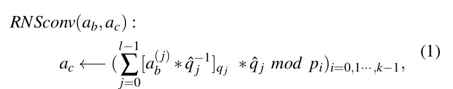

# dload 占位符加载内容说明

本文件用于说明当前项目中各个函数内 `dload` 占位符实际应加载的数据内容，便于测试同学准备输入数据与核对外部访存流。

## 通用约定

- `dload(rs1, rs2, pobj, type, small_bank)` 表示“为逻辑对象分配片上 SRAM 并从外存搬入数据”：
  - `type = mod_ctx, small_bank = 1`：对象状态表仍以 `pobj` 维护 `ALLOC/V/busy/base/len`，allocator 使用 `flag[0]` 将其物理 base 分配到 small Bank 5。
  - `type = poly`：加载多项式/RNS 通道数据或预计算常量（如 twiddle、qhat_inv 等）。
- 所有 custom1 指令固定使用 `x10/x11`；可执行 runtime 在每次发射前分别装入当前对象的 HPU_MEM line offset 与 line count。对象语义及具体 span 由硬件 line map/IT fixture 绑定。
- 模表 dload 后可直接执行 `pmodld MOD_ID`，DMA 一致性与对象可见性由硬件维护，不需要软件插入 `psync`。`pmodld` 不携带 `pobj`，而是按 MOD_ID 从 `mod_table_base_line` 选择上下文；模表物理顺序必须与 MOD_ID 一致。
- `psync` 仅在完整程序末尾发出一次，用于向 CPU 报告整个 HPU 程序完成；各算子 body 被组合时不得追加 `psync`。
- `dload` 使目标逻辑对象进入 live 状态。生成器在只读输入、常量、twiddle和模表对象最后一次使用后发出 `pfree`；输出使用 `dstore rel=1` 时由 DMA 完成后释放，不再重复发出 `pfree`。
- 当前 `SMALL_BANK_LINES=32`、`MOD_TABLE_BASE_LINE=0x1400`。每 line 容纳 16 个 context，物理容量为 512；受 8-bit `MOD_ID` 限制，软件最多生成 256 个 context。
- NTT 在 stage 0 前必须加载 `pre_twist` 并显式 PMUL；INTT 在最终 stage 后必须加载 `post_untwist_scale` 并显式 PMUL。

### 目标槽位编号说明

- 下文使用“源码变量名（实际槽位）”格式，例如 `POBJ_TMP_A (p0)`。`p0`才是汇编指令中编码的实际 `OBJ_ID`，变量名只用于解释语义。
- 当前复合算子普遍复用以下编号：

| 实际槽位 | 常见用途 | 说明 |
| --- | --- | --- |
| `p0` | 输入/工作对象 A | 密文分量、BConv 输入、NTT/INTT 数据对象 |
| `p1` | 输入/工作对象 B | 预计算常量、EVK、第二输入 |
| `p2` | 累加器/输出 | `pmul`/`pmac`/`padd` 的结果对象 |
| `p3` | 复合算子的 twiddle | KeySwitch/密文乘法使用普通表；Auto 按调用位置使用普通表或 `auto_idx` 特化表 |
| `p4` | 模表逻辑对象 | `dload ..., p4, 2, 1`，由 allocator 放入 small Bank 5 |

> 例外：独立 `output/ntt.asm` / `output/intt.asm` 由 `src/main.cpp`
> 传入 `obj_poly=p0` 和 `twiddle_obj=p1`；上表的 `p3` 是它们被复合算子
> 调用时的实际 twiddle 槽位。

---

## `generate_hpu_bconv_body_asm`
来源: [`src/util/bconv.cpp`](../src/util/bconv.cpp)

### dload 映射

| 位置 | 目标槽位 | 加载内容 | 说明 |
| --- | --- | --- | --- |
| 预处理阶段开头 | `POBJ_MOD_CTX (p4)` | **完整模表镜像**（输入 Q 与目标 P） | 使用 `type=2, small_bank=1` 分配到 Bank 5；由硬件保证可见性，随后按 `MOD_ID` 选择 |
| Stage 1: 每个 `q_j` | `POBJ_TMP_A (p0)` | `a_j`（输入多项式在 `q_j` 上的通道） | 注释中 `a_j` |
| Stage 1: 每个 `q_j` | `POBJ_TMP_B (p1)` | `qhat_inv_j` | 用于 `a_j * qhat_inv_j mod q_j` |
| Stage 2: 每个 `p_i`、每个 `q_j` | `POBJ_TMP_A (p0)` | `x_j`（Stage 1 输出的临时结果） | 注释中 `x_j` |
| Stage 2: 每个 `p_i`、每个 `q_j` | `POBJ_TMP_B (p1)` | `qhat_modp_j_i` | 预计算常量 |

Stage 2 的乘加结果保存在 `POBJ_ACC (p2)`，它不是 `dload`
目标，而是 `pmul/pmac` 目标和随后的 `dstore` 源对象。

---

## `generate_hpu_modup_body_asm`
来源: [`src/poly/modup.cpp`](../src/poly/modup.cpp)

### dload 映射

当前的 ModUp 语义是把 `Q[q_offset:q_offset+num_q_digit)` 对应的
Q digit 扩展成完整 `Q∪P`。它先原样保留 digit 中已有的 Q limbs，再通过
BConv 生成 `Q\digit ∪ P`：

| 位置 | 目标槽位 | 加载内容 | 说明 |
| --- | --- | --- | --- |
| BConv 之前，每个 source digit limb | 固定 `p0` | digit 中已有的 Q limb | `dload p0` 后立即 `dstore rel=1`，原样保留到完整基 workspace |
| 后续 BConv | `POBJ_MOD_CTX (p4)` / `POBJ_TMP_A (p0)` / `POBJ_TMP_B (p1)` | 模表、source limb/临时值、预计算常量 | 目标基是 `Q\digit ∪ P` |

`POBJ_ACC (p2)` 接收 BConv 累加结果。最终由原样保留的 digit limbs
和 BConv 生成的 `Q\digit ∪ P` 共同组成完整 `Q∪P`。

---

## `generate_hpu_moddown_body_asm`
来源: [`src/poly/moddown.cpp`](../src/poly/moddown.cpp)

### dload 映射

**Stage 1（BConv P -> Q，生成 correction term）**

- dload 行为与 BConv 相同，但“输入基”为 `P`，“目标基”为 `Q`。
- `q_j / qhat_inv_j / x_j / qhat_modp_j_i` 均应理解为 P->Q 场景对应的常量与中间值。

**Stage 2（修正并降模）**

| 位置 | 目标槽位 | 加载内容 | 说明 |
| --- | --- | --- | --- |
| Stage 2 开头（循环外仅一次） | `POBJ_MOD_CTX (p4)` | **完整 Q 模表镜像** | Bank 5 模表对象；后续 `pmodld MOD_ID` 切换 `q_i` |
| Stage 2 每个 `q_i` | `POBJ_Q (p0)` | `q` 基下的当前密文分量 | 被修正的输入 |
| Stage 2 每个 `q_i` | `POBJ_CORR (p1)` | correction term（由 Stage 1 产生） | `q - corr` |
| Stage 2 每个 `q_i` | `POBJ_P_INV (p2)` | `P^{-1} mod q_i` | 用于乘回缩放 |

---

## `generate_hpu_cmult_body_asm`
来源: [`src/poly/cmult.cpp`](../src/poly/cmult.cpp)

### dload 映射

| 位置 | 目标槽位 | 加载内容 | 说明 |
| --- | --- | --- | --- |
| 算子开头（循环外仅一次） | `POBJ_MOD_CTX (p4)` | **完整 Q 模表镜像** | Bank 5 模表对象；后续 `pmodld MOD_ID` 选择 `q_i` |
| 乘 `a0*b0` | `POBJ_A (p0)` / `POBJ_B (p1)` | `a0` / `b0` | 同一 `q_i` 基 |
| 乘 `a0*b1` | `POBJ_A (p0)` / `POBJ_B (p1)` | `a0` / `b1` | 同一 `q_i` 基 |
| 乘 `a1*b0` | `POBJ_A (p0)` / `POBJ_B (p1)` | `a1` / `b0` | 同一 `q_i` 基 |
| 乘 `a1*b1` | `POBJ_A (p0)` / `POBJ_B (p1)` | `a1` / `b1` | 同一 `q_i` 基 |

三个分量按 `out0 -> out1 -> out2` 的自然顺序计算和写回，均使用
`POBJ_OUT (p2)` 作为计算目标和 `dstore` 源对象。

---

## `generate_hpu_pmult_body_asm`
来源: [`src/poly/pmult.cpp`](../src/poly/pmult.cpp)

### dload 映射

| 位置 | 目标槽位 | 加载内容 | 说明 |
| --- | --- | --- | --- |
| 开头 | `POBJ_MOD_CTX (p4)` | **完整 Q 模表镜像** | Bank 5 模表对象；`pmodld MOD_ID` 切换 `q_i` |
| 每个 `q_i` 第一次 | `POBJ_CT (p0)` | `ct0`（第 0 分量） | 同一 `q_i` 基 |
| 每个 `q_i` 第一次 | `POBJ_PT (p1)` | `pt`（明文多项式） | 同一 `q_i` 基 |
| 每个 `q_i` 第二次 | `POBJ_CT (p0)` | `ct1`（第 1 分量） | 同一 `q_i` 基 |

> 注：`POBJ_PT (p1)` 只在第一次读取，两次乘法都将结果写到
> `POBJ_OUT (p2)`。若测试数据分开存放，需确保读指针一致或显式复用。

---

## `generate_hpu_ntt_body_asm` / `generate_hpu_intt_body_asm`
来源: [`src/util/ntt.cpp`](../src/util/ntt.cpp)

### dload 映射

| 位置 | 目标槽位 | 加载内容 | 说明 |
| --- | --- | --- | --- |
| NTT stage 0 之前 | `twiddle_obj`（独立生成为 `p1`；复合算子为 `p3`） | `pre_twist = psi^i` | 加载后执行显式 `pmul` |
| NTT 每个 stage | `twiddle_obj`（独立 `p1`；复合算子 `p3`） | 当前 stage 的 NTT twiddle 表 | `stage=0..logN-1`，每个 stage 加载一次 |
| INTT 每个 stage | `twiddle_obj`（独立 `p1`；复合算子 `p3`） | 当前 stage 的 INTT twiddle 表 | `stage=0..logN-1`，每个 stage 加载一次 |
| INTT 最后一个 stage 之后 | `twiddle_obj`（独立 `p1`；复合算子 `p3`） | `post_untwist_scale = N^-1 * psi^-i` | 加载后执行显式 `pmul` |

> 备注：`obj_poly`（当前调用均为 `p0`）是跨 stage 保持不变的
> **逻辑数据对象**。控制器可以为它重分配物理 base；body 函数不加载
> `mod_ctx`，由外层调用方加载（复合算子通常为 `p4`）。

---

## `generate_hpu_keyswitch_body_asm`
来源: [`src/operator/keyswitch.cpp`](../src/operator/keyswitch.cpp)

### dload 映射（核心步骤）

**Step 1: ModUp（Q digit -> Q∪P）**

- 复 `generate_hpu_modup_body_asm`，将当前 Q digit 扩展到
  完整 `Q∪P`。槽位为 `p0`=原始 digit limb/临时值，`p1`=预计算常量，
  `p2`=BConv 累加输出，`p4`=模表（见 ModUp 一节）。

**Step 2: NTT on Q & P**

| 位置 | 目标槽位 | 加载内容 | 说明 |
| --- | --- | --- | --- |
| Step 2 开头 | `POBJ_MOD_CTX (p4)` | 完整 `Q∪P` 模表镜像 | 当前 digit 仅加载一次 |
| 每个基 | `POBJ_TMP_A (p0)` | `switching_component_up` 的当前基分片 | ModUp 输出的完整基分片 |
| 每个基 | `TWIDDLE (p3)` | NTT `pre_twist` 和逐 stage twiddle 表 | 每个基共 `1+logN` 次 twiddle `dload` |

**Step 3: Multiply with EVK**

| 位置 | 目标槽位 | 加载内容 | 说明 |
| --- | --- | --- | --- |
| 每个基、每个 `v` | `POBJ_CT (p0)` | `switching_component_ntt` 当前基分片 | NTT 后的切换分量 |
| 每个基、每个 `v` | `POBJ_EVK (p1)` | `evk[v]` 当前基分片 | 评估密钥 |
| 非首 digit | `POBJ_OUT (p2)` | 累加中间值 | 来自上一次 digit 结果；首 digit 直接以 `p2` 作为 `pmul` 目标 |

**Step 4: INTT on Q & P**

| 位置 | 目标槽位 | 加载内容 | 说明 |
| --- | --- | --- | --- |
| Step 4 开头 | `POBJ_MOD_CTX2 (p4)` | 完整 `Q∪P` 模表镜像 | 两个 `v` 共用，仅加载一次 |
| 每个基、每个 `v` | `POBJ_TMP_A2 (p0)` | `out[v]` 当前基分片 | 乘加后的结果 |
| 每个基、每个 `v` | `TWIDDLE2 (p3)` | INTT 逐 stage twiddle 和 `post_untwist_scale` | 每个基共 `logN+1` 次 twiddle `dload` |

**Step 5: ModDown**

- 复用 `generate_hpu_moddown_body_asm` 的 dload 语义（见上文）。

**Step 6: Add base to out0**

| 位置 | 目标槽位 | 加载内容 | 说明 |
| --- | --- | --- | --- |
| Step 6 开头 | `POBJ_MOD_CTX_S6 (p4)` | 完整 Q 模表镜像 | 循环外仅加载一次 |
| 每个 `q_i` | `POBJ_OUT0 (p0)` | `out0`（ModDown 后） | 当前基分片 |
| 每个 `q_i` | `POBJ_BASE (p1)` | 不参与分解的 base 分量；普通 KeySwitch 中为 `c0` | 当前基分片 |

加法结果保存到 `POBJ_FINAL_OUT0 (p2)` 并由 `dstore` 写回。完整接口语义为
`KeySwitch(base, switching_component, evk) -> (base + ks0, ks1)`。

---

## `generate_hpu_relinearization_body_asm`
来源: [`src/operator/relinearization.cpp`](../src/operator/relinearization.cpp)

重线性化将 `t0` 绑定为 KeySwitch 的 `base`，将 `t2` 绑定为
`switching_component`，并使用 `rlk` 调用完整 KeySwitch。该调用先产生
`(t0 + ks0, ks1)`；随后逐个 `q_i` 加载 `t1` 与 `ks1`，执行 `padd` 并写回
第二输出分量，最终得到 `(t0 + ks0, t1 + ks1)`。

最终第二分量合并的实际槽位为：

| 位置 | 目标槽位 | 加载内容 |
| --- | --- | --- |
| 合并开头 | `POBJ_MOD_CTX (p4)` | 完整 Q 模表镜像，仅加载一次 |
| 每个 `q_i` | `POBJ_T1 (p0)` | `t1` 当前 Q limb |
| 每个 `q_i` | `POBJ_KS1 (p1)` | KeySwitch 生成的 `ks1` 当前 Q limb |

`padd` 将结果写到 `POBJ_OUT1 (p2)`，随后以 `dstore rel=1` 导出。

---

## `generate_hpu_ciphertext_multiply_body_asm`
来源: [`src/operator/ciphertext_multiply.cpp`](../src/operator/ciphertext_multiply.cpp)

完整乘法遵循 RLWE 密文乘法与重线性化流程，不等同于仅计算三分量张量积的 `cmult`：

1. 对两个输入密文的 `c0/c1` 分量执行 NTT。
2. 在每个 `q_i` 上计算 `t0=a0*b0`、`t1=a0*b1+a1*b0`、`t2=a1*b1`。
3. 将 `t0/t1/t2` 执行 INTT，得到 Q 基系数域三分量密文。
4. 调用 `generate_hpu_relinearization_body_asm`：以 `t0` 为 base 对 `t2` 执行完整 KeySwitch。
5. Relinearization 再计算 `t1 + ks1`，输出重新线性化后的二分量密文。

### 主要 dload/dstore 数据

| 阶段 | 加载内容 | 存储内容 |
| --- | --- | --- |
| 输入 NTT | `p0`=`ct_a_q/ct_b_q` 当前 limb，`p3`=NTT twiddle，`p4`=Q 模表 | 两个密文的 NTT 域分量（从 `p0` dstore） |
| 张量积 | `p0/p1`=NTT 域 `a0/a1` 与 `b0/b1`，`p4`=Q 模表 | `p2`=NTT 域 `t0/t1/t2` |
| 张量 INTT | `p0`=`t0/t1/t2`，`p3`=INTT twiddle，`p4`=Q 模表 | 系数域 `t0/t1/t2`（从 `p0` dstore） |
| digit ModUp/NTT | `p0/p1`=digit/BConv 常量，`p3`=twiddle，`p4`=Q∪P 模表 | `p2`=BConv 结果，随后 `p0`=Q∪P 上的 digit NTT |
| EVK 乘加 | `p0`=digit NTT，`p1`=`relinearization_key_ntt_qp`，非首 digit 另加载 `p2`=累加值 | `p2`=Q∪P 上两个 key-switch 分量 |
| INTT/ModDown | `p0/p1`=累加分量/基转换常量，`p2`=临时输出，`p3`=twiddle，`p4`=模表 | Q 基 key-switch correction |
| 最终合并 | 第一分量：`p0`=`ks0 correction`、`p1`=`t0`；第二分量：`p0`=`t1`、`p1`=`ks1`；`p4`=Q 模表 | `p2`=`ciphertext_out_q` 当前 limb |

Reference 中上述逻辑对象的文件、shape 和 checksum 见 `outputs/ciphertext_multiply/test_data/artifact_manifest.csv`；硬件 `uint32` 文件、checksum、line offset/count 分别见 `hardware/hardware_manifest.csv` 和 `hardware/line_map.csv`。可执行后端固定编码 `x10/x11`，并在每条 DMA 前从调用方提供的 span 数组装载实际 line offset/count；Nexus-AM 集成还会生成逐条 resolved relocation manifest。

---

## `generate_hpu_auto_body_asm`
来源: [`src/poly/auto.cpp`](../src/poly/auto.cpp)

### dload 映射（核心步骤）

当前冻结的唯一入口是 `auto_idx=1`，对应 Galois element 3。CPU runtime
先按负循环环 `X^N+1` 对两个密文分量执行 `sigma_3: a(X)->a(X^3)`，并将
旋转后的 Q4 分量写入 HPU_MEM。HPU 随后执行完整 Galois KeySwitch：

1. 对旋转后的 `c1` 做 D2 ModUp；
2. 对 Q4/P3 的所有 limb 做 NTT；
3. 与冻结的 `galois_key[digit][component][basis]` 逐点乘加；
4. 对两个累加分量做 INTT 和 ModDown；
5. 把旋转后的 `c0` 并入第一输出分量，末尾仅发出一次 `psync`。

DMA 槽位和顺序与 KeySwitch 一致，共 716 条 relocation。Nexus-AM 的
`auto.csv` 为每条 DMA 给出 `logical_data_ref`、line offset/count 和边界；
输入、Galois key、完整 HPU_MEM 镜像及逐字 golden 位于
`outputs/auto/test_data/hardware/`。不再存在 `x_c0/x_offset/x_out` 等符号寄存器。

---

## 未显式包含 dload 的算子

- `generate_hpu_mm_body_asm` 仅执行 `pmul`，无 `dload`（见 [`src/util/mm.cpp`](../src/util/mm.cpp)）。
- 注意这里指的是 body 函数；完整 `generate_hpu_mm_asm` 会额外把模表加载到
  调用方指定的 `mod_ctx_obj`（当前独立 `output/mm.cpp` 为 `p3`）。
